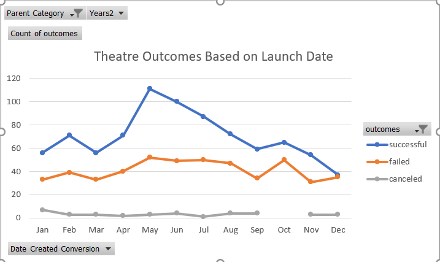
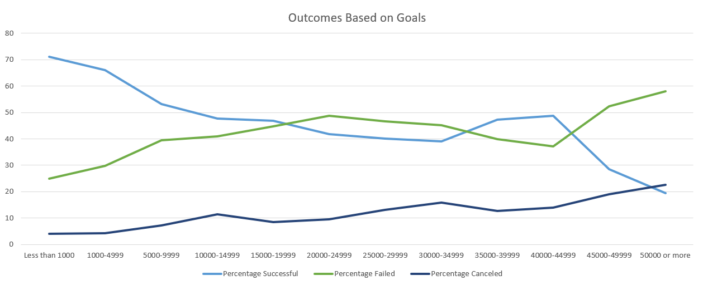

# Kickstarting with Excel
## Colin Leung

## Overview of Project

### Purpose
Louise is a playright who wants to start a crowd funding campaign to help fund her play, "Fever", and she is unsure on the logistics of the funding towards her cause. On the given Excel, we are given multiple criterias and characteristics of the funds provided for other plays. Through using the tools on Excel, we must determine which factors have the most significant impact that would make Louise's project's campaign successful. The insights formulated from Excel will inform us how to provide Louise with the best chance of success. The most significant varaible observed in the Excel table was the outcome columns which displyed which campaigns resulted in success, failure, or if it was canceled. The other columns inform other criterias which we analyzed to determine which of these factors were most associated with success. 

## Analysis and Challenges

### Analysis of Outcomes Based on Launch Date

The outcomes based on launch date showed the relationship between the months of the year and the amount of successes, failures, or canceled. The vertical axis of the line graph displays the quantity of successes, failures, or canceled and the horizontal axis displays the twelve months of the year. From the line graph, it can be determined that the months May and June are associated with the greatest quanitity of successes whereas December is related to the lease amount of successes. It is important to note that in the month of December, the amount of successes and failures are almost equal which implies that from the given data, there is about an equal probability to have either a success or failure in the month of December.

### Analysis of Outcomes Based on Goals

The outcomes based on goals displayed the quanity of successes, failures and cancels relative to the total amount of campaigns wihtin a given goal donation range. There were a total of twelve subsets of goal donation ranges and with each set, the line graph shows the percentage distribution for each of the three outcomes. From the line graph, when the goal is less than 1000, there is the maximum percentage of successful campaigns and the amount of successes are more than the other two outcomes. In contrast, at 50,000 dollars or more, there are a significantly larger amount of failures than successful campaigns. 

### Challenges and Difficulties Encountered
For the outcomes based on launch date, my greatest challenge was creating the year criteria from the date created conversion and isolating the date created conversion from quarter and year into the pivot table. This challenge was not difficult to overcome since the Modules explained very thoroughly. After adding the date created conversion, removing the year and quarter criteria was done through dragging them out of the row section of the pivot tables. All other objectives of Deliverable 1 was straightforward and simple since the Modules provided step by step instrcutions and very similar examples. Some difficulties could be correctly populating the pivot tables, and this would be accomplished through using the filters properly to isolate and abstract specific parameters. 

For the outcomes based on goals, my greatest challenge was counting all of the successful, failure and canceled totals given multiple contraits. First, creating the subcategory "plays" was done by creating a filter on the entire column. The difficulty I faced was in using the countifs statement correctly. I had a bug in my code since I originally used the countif function which only allows for a single criteria. I fixed this bug by adding an "s" to the end of my function call which then allowed me to input multiple criterias, those being the goal amount and the outcome result. The sum function added all of the campaigns in a row which were separated by goal amount. Then by dividing each individual outcome amount by the total quantity of campaigns in that goal range, and multiplying by 100, the percentages were computed. 

## Results

### What are two conclusions you can draw about the Outcomes based on Launch Date?
From the outcomes based on launch date, I can determine that in the month of March, campaigns have the greatest chance of success while in the month of December, campaigns have the lowest chance of success. 
### What can you conclude about the Outcomes based on Goals?
From the outcomes based on goals, I can determine that when the goal funding is less than 1000 dollars, there is the greatest chance of success and when the goal is greater than 50,000 dollars, there is the lowest chance of success. There is a general trend that the greater the goal funding amount, the lower the chance of success however this is not a definite quality since a goal of 35,000-40,000 had a greater success amount than 30,000-35,000.
### What are some limitations of this dataset?
Some limitations of this dataset are the qualities of the play. We know the amount of money funded, the goal amount, the start date and so on, however the quality of the play should be a factor of its success since it determines its survivability. Additionally, this data set informs the country, but within some countries, regions can be very diverse.
### What are some other possible tables and/or graphs that we could create?
From the limitations, we could add a table that includes a more specific region where the play was produced. For graphs, we could have analyzed the relationship between the amount funded and the country since each country has a different magnitude of prioritization of the arts. In other words, if one country funds more towards the arts than another, then that country would comparitively have a greater percentage of successes. 
